# Warrior-Setup
Help preserve [Yahoo! Answers](https://www.virtualbox.org/wiki/Downloads) as a team.
This archiving project was setup by the [ArchiveTeam](https://wiki.archiveteam.org/index.php/Main_Page).

This setup is mainly for Virtual Box on Windows, if you are on OSX, you can watch [this video](https://www.youtube.com/watch?v=_nzD-QpmePE).

Instructions for using VMWare and Docker can be found [here](https://wiki.archiveteam.org/index.php/ArchiveTeam_Warrior#Basic_usage).
If you download and run a different version of Warrior, skip to step 10 of this setup guide
## Setup

__1.__ Goto the [Virtual Box Downloads](https://www.virtualbox.org/wiki/Downloads) page and download the version for your platform
[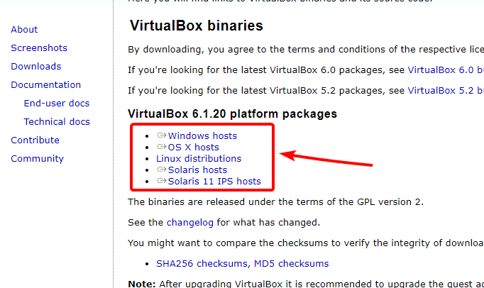](https://www.virtualbox.org/wiki/Downloads)

__2.__ After installing Virtual Box, goto the [Archiveteam Downloads](https://warriorhq.archiveteam.org/downloads/warrior3/) page and download the beta `.ova` file `v3.2-beta-20210228.ova`
[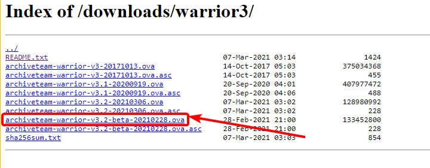](https://warriorhq.archiveteam.org/downloads/warrior3/)

__3.__ After downloading the `.ova` file, go back to Virtual Box and click `File` -> `Import Appliance`
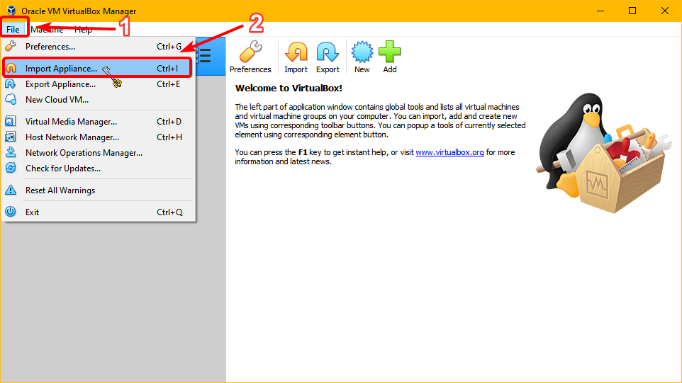

__4.__ Select the `.ova` file from your file explorer
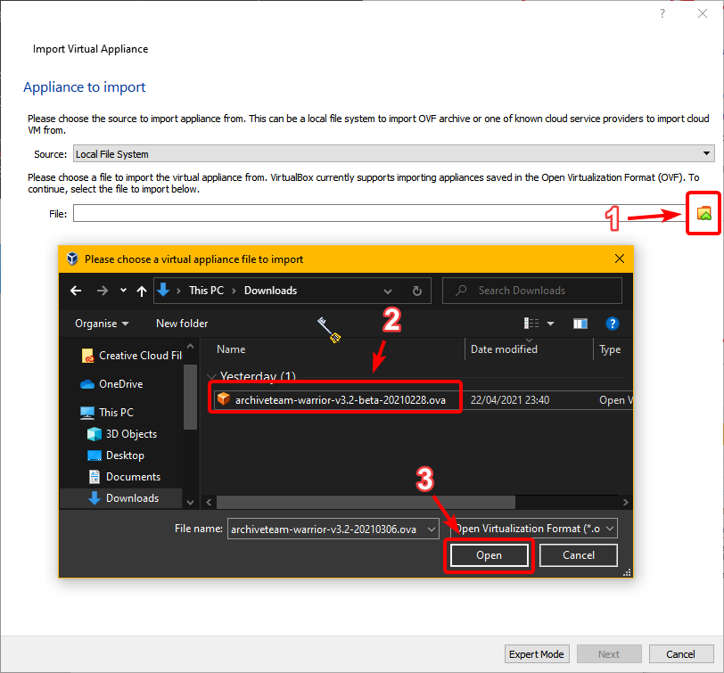

__5.__ Click `Next`
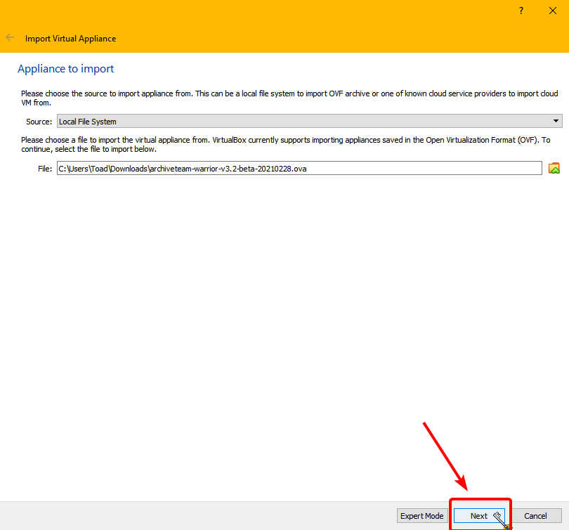

__6.__ Leave all the settings as default, and click `Import`
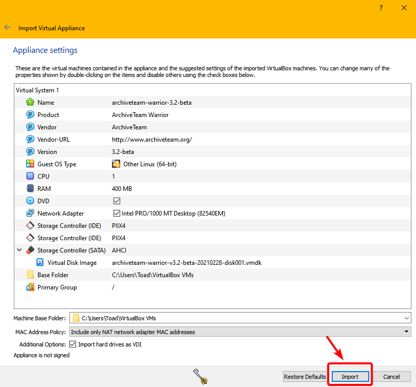

__7.__ After it has imported, select the appliance and click the `Start` button
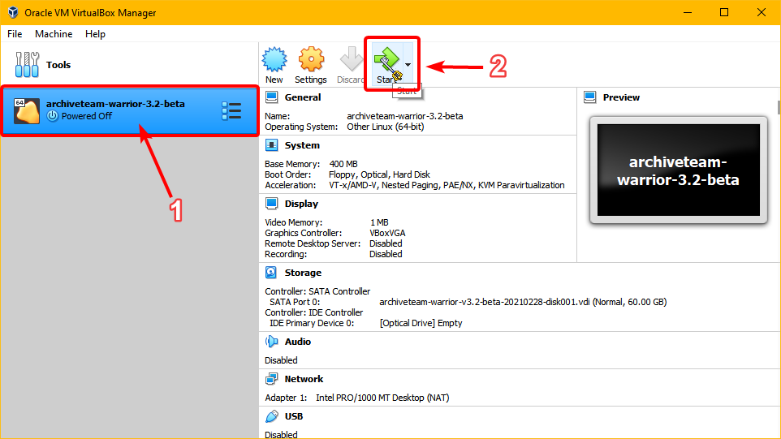

__8.__ The virtual appliance will start in a new window, you don't have to do anything as it'll automatically setup everything
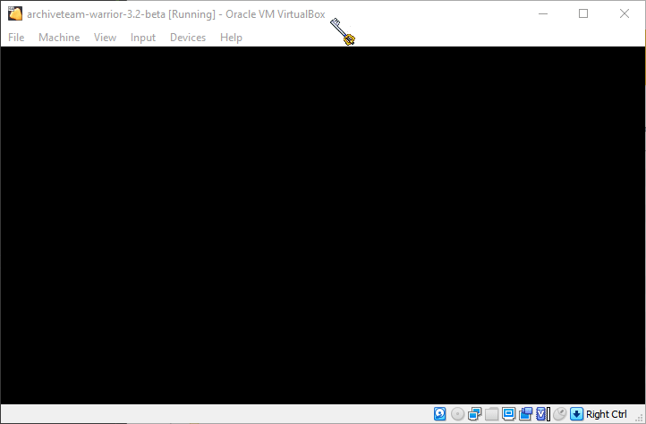

__9.__ When it's finished, your window should look like this
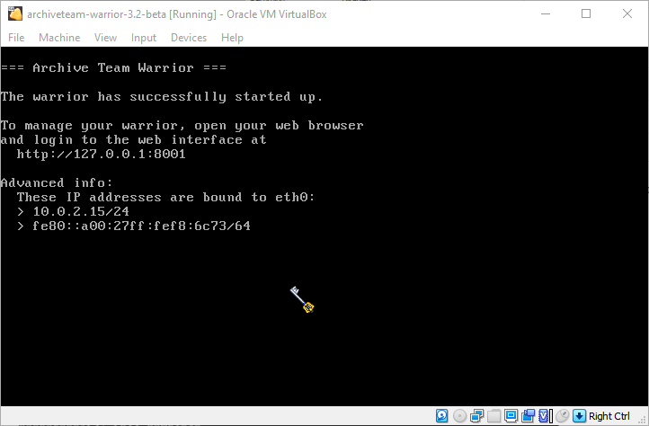

__10.__ Now open your web browser and goto [http://127.0.0.1:8001/](http://127.0.0.1:8001/) or [http://localhost:8001/](http://localhost:8001/). The page should look like this
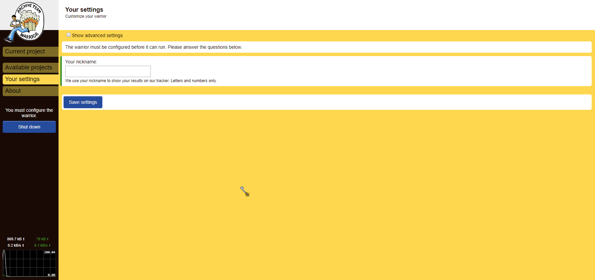

__11.__ Now to start archiving!
Firstly change your `nickname` to `DueUtil`, like so
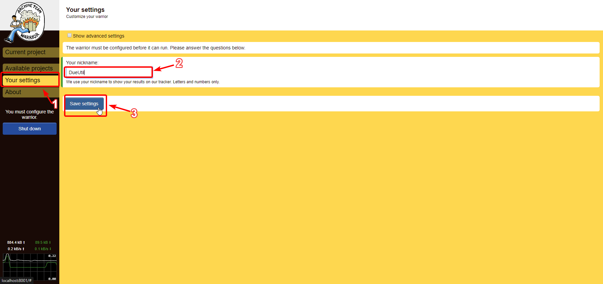

Secondly, if you have a high internet connection (more than 4mpbs), you can increase how quickly you archive by changing your `Concurrent items`. The maximum you can change it to is `6`
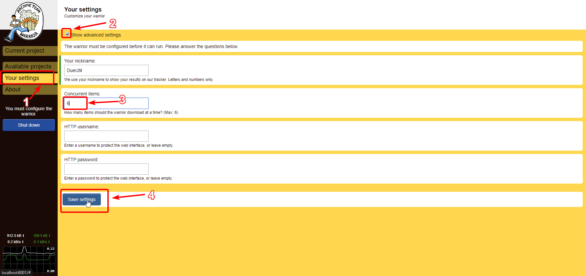

Finally select the `Yahoo! Answers` project
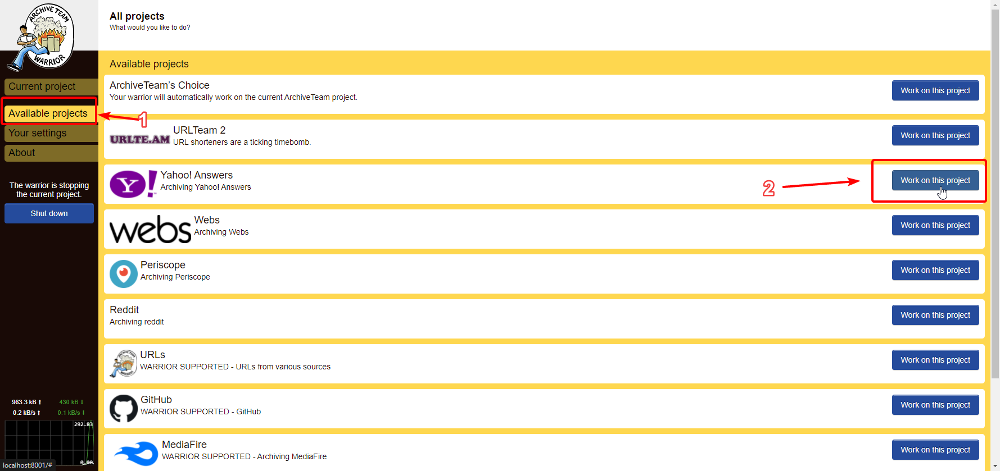

And that's it!
You can close out of the web browser, but you **MUST NOT close the virtual box window**
